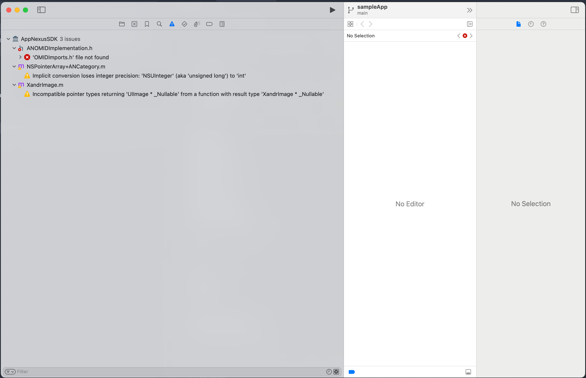

# AppNexus iOs sdk 8.11.0 - build error


this is a minimal reproducer for the build error that occurs when using the AppNexus iOs sdk 8.11.0

``` Lexical or Preprocessor Issue (Xcode): 'OMIDImports.h' file not found
/Users/d438477/devel/github.com/thekorn/xandr/packages/xandr/example/ios/Pods/AppNexusSDK/sdk/sourcefiles/Viewability/ANOMIDImplementation.h:22:8


Lexical or Preprocessor Issue (Xcode): 'OMIDImports.h' file not found
/Users/d438477/devel/github.com/thekorn/xandr/packages/xandr/example/ios/Pods/AppNexusSDK/sdk/sourcefiles/native/internal/ANNativeAdResponse+PrivateMethods.h:22:20
```

